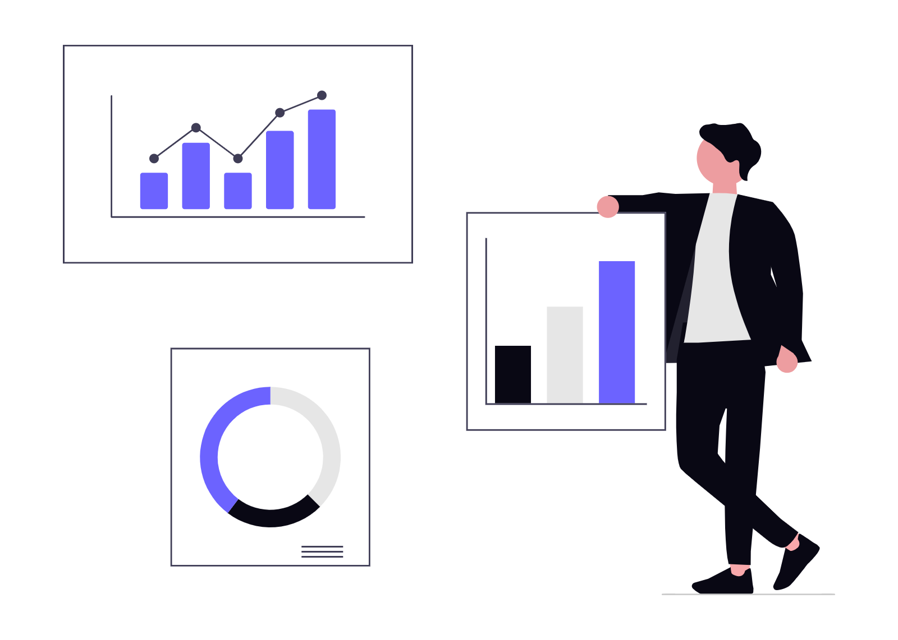

  

<table>
<tr>
<td width="60%" valign="top">

sabari7813@dev-machine cat README.md

# Hi, I'm

# Sabarinathan

### Aspiring Data Analyst & Data Scientist

> I don't just analyze data,
> I turn it into decisions.

### ⚙️ Tech Stack

### ⚡ About Me
- 🔍 I build data-driven insights using Python & SQL
- 📊 Always learning, constantly analyzing
- 🚀 Turning raw numbers into real decisions

</td>
<td width="40%" align="center">

</td>
</tr>
</table>

---

### 📌 Quick Stats

| 📦 Repos | 💻 Commits | ⭐ Stars | 👥 Followers |
|:---:|:---:|:---:|:---:|
| 5 | 29+ | 1 | 0 |

---

### 🚀 Key Projects

| Project | Tech Stack | Description |
|---|---|---|
| [TokenSentry](https://github.com/sabari7813/ai-cost-watchdog) | `Python` `Dashboard` | Real-time AI cost & token usage monitor across GPT-4, Claude & Gemini |

> *"Data speaks, if you know how to listen."*

---

### 📊 GitHub Stats & Graphs

  
  

  

### ☑️ Contribution Graph

  

  

---

### 🐍 Watch the snake eat my contributions

  

---

### 🤝 Let's Connect

  
  
  
  

  

<p
