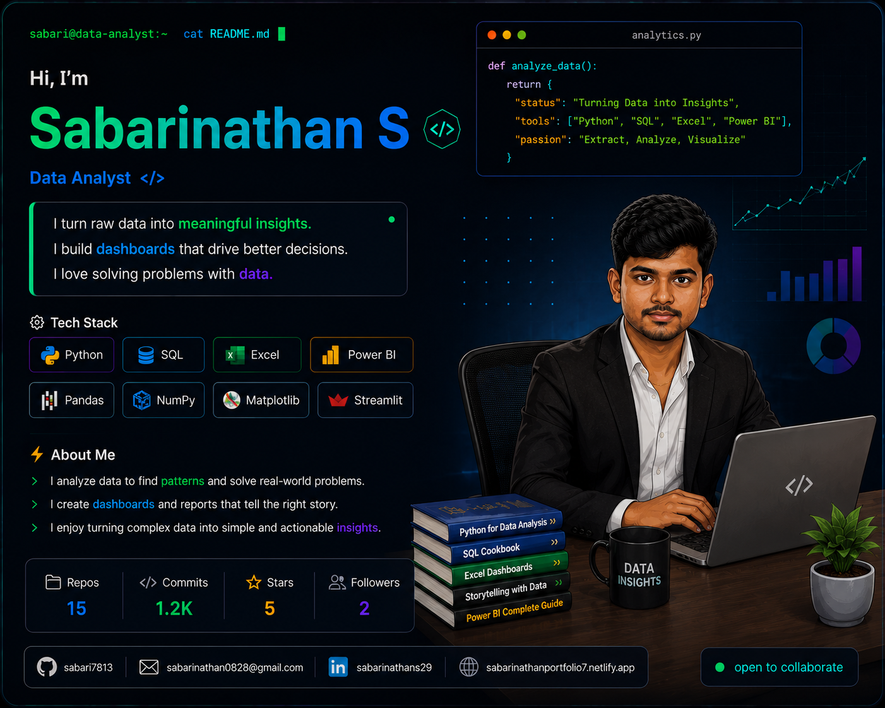

<h1 align="center">
  
</h1>

Turning data into meaningful insights and practical solutions.

 

<!-- ===================== TYPING TERMINAL ===================== -->

  

 

<!-- ===================== FIRST IMAGE ===================== -->

  

 

<!-- ===================== KEY PROJECTS ===================== -->
<table width="100%">
<tr>

<td width="35%" align="center" valign="middle">

</td>

<td width="65%" valign="top">

<h2>🚀 Key Projects</h2>

<table width="100%">
<tr>
<th>Project</th>
<th>Tech Stack</th>
<th>Status</th>
</tr>

<tr>
<td>
<a href="https://github.com/sabari7813/ai-cost-watchdog">
AI Cost Watchdog
</a>
</td>
<td>
<code>Python</code> <code>Streamlit</code>
</td>
<td>
⭐ 
</td>
</tr>

<tr>
<td>
<a href="https://github.com/sabari7813/tracking-dairy">
Tracking Dairy
</a>
</td>
<td>
<code>HTML</code>
</td>
<td>
⭐ 
</td>
</tr>

<tr>
<td>
<a href="https://github.com/sabari7813/portfolio">
Personal Portfolio
</a>
</td>
<td>
<code>HTML</code> <code>CSS</code> <code>JavaScript</code>
</td>
<td>
⭐ 
</td>
</tr>

<tr>
<td>
<a href="https://github.com/sabari7813/100-_days_coding_challenges">
100 Days Coding Challenges
</a>
</td>
<td>
<code>Python</code>
</td>
<td>
⭐ 
</td>
</tr>

</table>

 

💡 <i>"Turning ideas into real world solutions."</i>

</td>

</tr>
</table>

 

<!-- ===================== GITHUB STATS ===================== -->

<h2 align="center">📊 GitHub Stats & Graphs</h2>

 

<table width="85%" align="center">
<tr>

<td width="50%" align="center">

</td>

<td width="50%" align="center">

</td>

</tr>
</table>

<!-- ===================== CONTRIBUTION STATS ===================== -->
 

  

 

<!-- ===================== CONTRIBUTION GRAPH ===================== -->
<h2 align="center">📈 Contribution Graph</h2>

  

 

<!-- ===================== LET'S CONNECT ===================== -->
<h2 align="center">🤝 Let's Connect</h2>

  
  
  
  

 

  

 

  <i>📈 Where numbers meet narrative 🚀</i>

  

